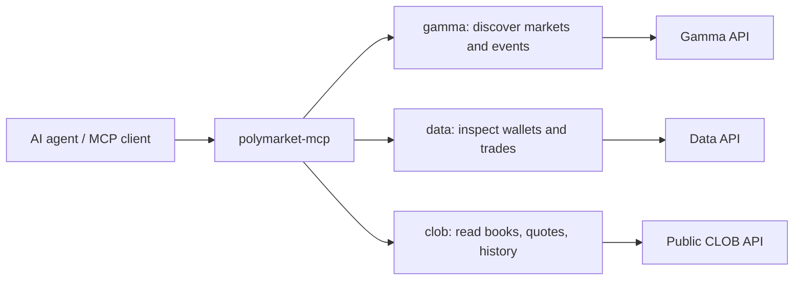

# polymarket-mcp

[](https://github.com/pr1m8/polymarket-mcp/actions/workflows/ci.yml)
[](https://github.com/pr1m8/polymarket-mcp/actions/workflows/release.yml)
[](https://pypi.org/project/polymarket-mcp-server/)
[](https://pypi.org/project/polymarket-mcp-server/)
[](https://polymarket-mcp.readthedocs.io/en/latest/)
[](https://gofastmcp.com/)
[](#safety-model)

AI-agent ready FastMCP server for Polymarket market discovery, wallet analytics, and public CLOB data.

`polymarket-mcp` gives MCP clients a typed, read-only interface for asking questions like:

- "Find active markets about inflation and summarize liquidity."
- "Inspect this wallet's current positions and recent activity."
- "Compare order book depth, midpoint, and spread for these outcome tokens."
- "Pull historical prices so an agent can reason about market movement."

This project is intentionally read-only in `0.1.x`. It does not place trades, sign orders, manage keys, or require wallet credentials.

## Package identities

| Purpose | Value |
| --- | --- |
| PyPI distribution | `polymarket-mcp-server` |
| Python package | `polymarket_mcp` |
| CLI command | `polymarket-mcp` |
| Docs | <https://polymarket-mcp.readthedocs.io/en/latest/> |

## Why agents use it

- Typed outputs reduce brittle prompt parsing and normalize inconsistent upstream JSON.
- Tool docstrings are written for LLM routing, so agents can choose the right surface quickly.
- Namespaces keep workflows clear: `gamma` for discovery, `data` for wallets, `clob` for live market microstructure.
- Real MCP end-to-end tests exercise both in-process client sessions and subprocess stdio transport.
- No authenticated trading actions are exposed, which keeps exploratory agents inside a safer read-only boundary.

## Agent workflow



## Tool surfaces

| Surface | Agent job | Example outputs |
| --- | --- | --- |
| `gamma` | discover and inspect markets/events | market metadata, event details, tags |
| `data` | analyze public wallet behavior | positions, activity, trades |
| `clob` | reason about live prices and liquidity | books, quotes, midpoint, spread, history |

## Install

```bash
pip install polymarket-mcp-server
polymarket-mcp
```

Run ephemerally with `uvx`:

```bash
uvx --from polymarket-mcp-server polymarket-mcp
```

## MCP client config

Use this stdio entry in an MCP client configuration:

```json
{
  "mcpServers": {
    "polymarket": {
      "command": "uvx",
      "args": ["--from", "polymarket-mcp-server", "polymarket-mcp"]
    }
  }
}
```

## Local development

This repository uses PDM.

```bash
pdm install -G dev
pdm install -G docs
pdm run mcp-inspect      # inspect the composed MCP surface
pdm run mcp-run          # run the stdio MCP server
pdm run test             # run pytest
pdm run test-mcp         # run real MCP client/server e2e tests
pdm run all              # tests + strict docs + MCP inspect
```

Run the package entrypoint directly:

```bash
pdm run python -m polymarket_mcp.server
```

## Safety model

`polymarket-mcp` is built for research, monitoring, and agent reasoning over public data. It intentionally excludes:

- private key handling
- authenticated trading
- order placement or cancellation
- wallet mutation
- custody or signing flows

If you build a trading layer on top, keep it separate from this read-only server and require explicit human authorization.

## Project layout

```text
src/polymarket_mcp/
  models/     Pydantic domain and tool I/O models
  services/   upstream API normalization layers
  servers/    FastMCP tool and resource surfaces
  server.py   composed parent MCP server
tests/        unit and MCP end-to-end coverage
docs/         Sphinx documentation
```

## Documentation

- Hosted docs: <https://polymarket-mcp.readthedocs.io/en/latest/>
- Docs source: `docs/` using native Sphinx reStructuredText
- Local build: `pdm run docs`
- Local preview: `pdm run docs-serve`

## Release notes

Releases publish from Git tags through GitHub Actions trusted publishing. PyPI trusted publishing is configured for `pr1m8/polymarket-mcp`, workflow `release.yml`, environment `pypi`.
