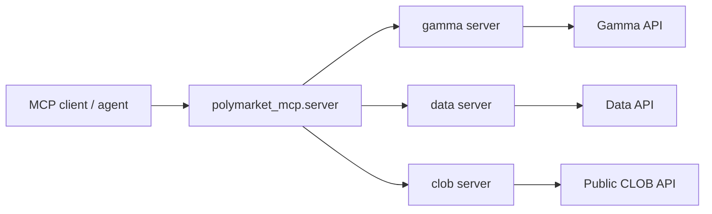

# polymarket-mcp

[](https://github.com/pr1m8/polymarket-mcp/actions/workflows/ci.yml)
[](https://github.com/pr1m8/polymarket-mcp/actions/workflows/release.yml)
[](https://pypi.org/project/polymarket-mcp-server/)
[](https://pypi.org/project/polymarket-mcp-server/)
[](https://polymarket-mcp.readthedocs.io/en/latest/)

Typed FastMCP server for Polymarket discovery, wallet analytics, and public CLOB market data.

This package is intentionally read-only in `0.1.x`. It helps agents and MCP clients inspect markets, wallets, books, quotes, and history without exposing authenticated trading actions.

PyPI distribution: `polymarket-mcp-server`  
Python package: `polymarket_mcp`  
CLI command: `polymarket-mcp`

## What you get

| Surface | Purpose | Examples |
| --- | --- | --- |
| `gamma` | market and event discovery | topic search, event lookup, metadata |
| `data` | wallet reads | positions, activity, trades |
| `clob` | live public market state | books, quotes, midpoint, spread, history |



## Install

```bash
pip install polymarket-mcp-server
```

For local development with PDM:

```bash
pdm install -G dev
pdm install -G docs
```

## Quick start

```bash
pdm run mcp-inspect      # inspect the composed server surface
pdm run mcp-run          # run the stdio MCP server
pdm run test             # run the full pytest suite
pdm run test-mcp         # run MCP client/server end-to-end tests
pdm run all              # tests + docs + MCP inspect
```

Run the package directly:

```bash
pdm run python -m polymarket_mcp.server
```

## Project layout

```text
src/polymarket_mcp/
  models/     typed domain and tool I/O models
  services/   upstream normalization layers
  servers/    FastMCP tool/resource surfaces
  server.py   composed parent MCP server
tests/        unit and MCP end-to-end coverage
docs/         Sphinx documentation
```

## Documentation

- Docs source: `docs/`
- Local build: `pdm run docs`
- Local preview: `pdm run docs-serve`
- Published docs target: Read the Docs via `.readthedocs.yaml`

## Development notes

- Tool docstrings are written for LLM tool selection, not just human API reference.
- `tests/test_mcp_e2e.py` now covers both in-process and subprocess MCP usage.
- `pdm run mcp-dev` uses the FastMCP inspector flow; if the inspector package is not cached locally, the first run may need external package access.
